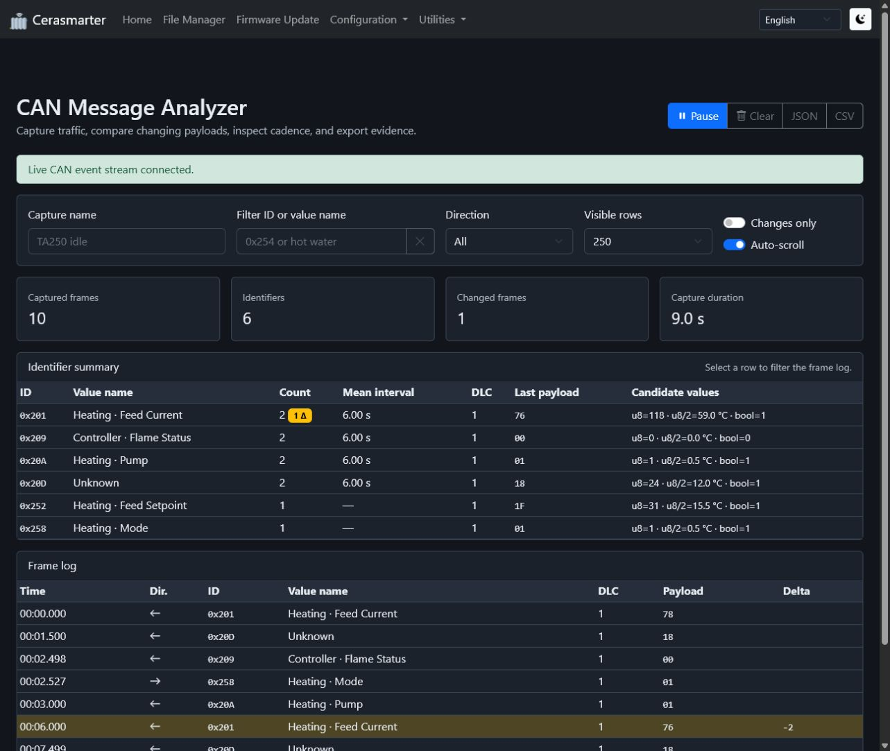
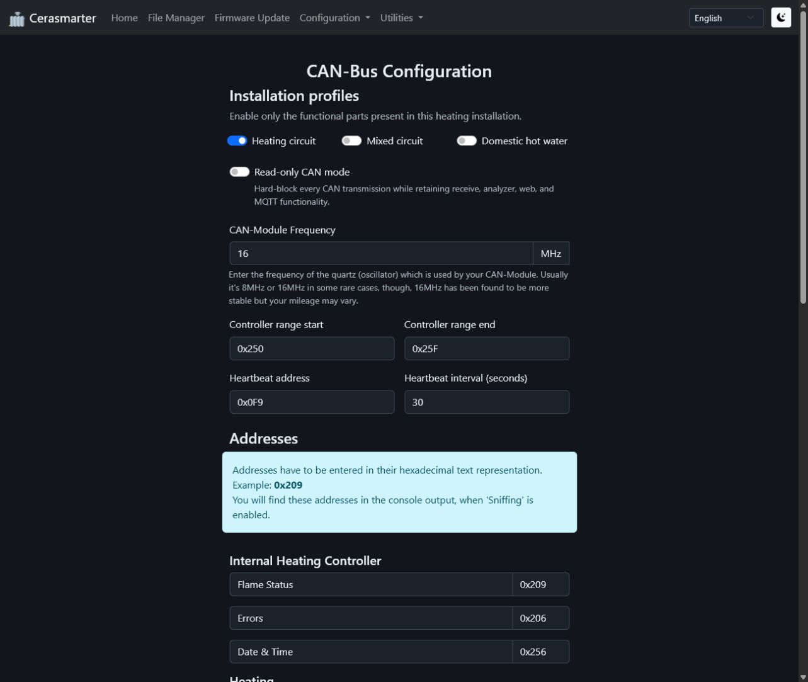

# CAN Message Analyzer

The CAN Message Analyzer in **Utilities > CAN Message Analyzer** records the live CAN traffic already seen by Cerasmarter. It is intended to help identify installation-specific addresses, compare controller states, and produce captures that can be reviewed without enabling verbose serial or Telnet logging.

## Before starting

- Do not open the boiler or change its wiring unless you are qualified to work on it. The analyzer only observes traffic available to the installed controller.
- Use **Configuration > CAN Bus > CAN read-only mode** while investigating an unfamiliar installation. Read-only mode blocks Cerasmarter transmissions but leaves reception, the analyzer, the web UI, and MQTT available.
- Select only the installation profiles that actually exist: heating, mixed circuit, and domestic hot water. Profiles describe boiler-side functionality, not the model of room controller.
- Confirm that the status banner says **Live CAN event stream connected**. This confirms the browser connection to Cerasmarter; meaningful frames additionally require a working CAN interface and bus connection.
- The analyzer is independent of the console **Sniffing** option. Sniffing can remain disabled.

## Recommended capture workflow

1. Enter a descriptive capture name, such as `heating-idle`, `hot-water-request`, or `mixer-opening`.
2. Select **Clear** immediately before the observation period. This removes all captured frames and resets change comparisons and statistics.
3. Record a stable baseline for at least 30 seconds. Slow status messages may need several minutes.
4. Change exactly one observable condition, for example request domestic hot water or adjust one setpoint. Avoid combining several actions in one capture.
5. Watch the **Identifier summary** for IDs whose payload or cadence changes. Select a summary row to filter the frame log to that ID.
6. Use the × button beside the filter to reset the text, direction, and **Changes only** filters. It does not clear the capture.
7. Select **Pause** before reviewing or exporting so the evidence remains stable.
8. Export JSON for complete machine-readable evidence or CSV for a spreadsheet comparison. Preserve both the baseline and changed-state captures and describe the action and timing when sharing them.

Captures exist only in the current browser page. Reloading or leaving the page discards them unless they were exported.

## Controls and filters

| Control | Effect |
| --- | --- |
| Pause / Resume | Stops or resumes adding frames without clearing existing data. |
| Clear | Removes frames, per-ID statistics, and previous-payload comparisons. |
| Capture name | Becomes part of the exported filename and JSON metadata. |
| ID or value-name filter | Matches a hexadecimal identifier such as `0x254` or a configured name such as `hot water`. Selecting a summary row fills this filter. |
| Reset filters (×) | Clears the text filter, restores direction to **All**, and disables **Changes only**. |
| Direction | Shows received frames, frames sent by Cerasmarter, or both. |
| Visible rows | Limits only the rendered frame log. It does not reduce the frames included in statistics or exports. |
| Changes only | Shows frames whose DLC or payload differs from the previous frame with the same ID and direction. The first frame has no comparison and is not marked changed. |
| Auto-scroll | Keeps the newest visible frame at the bottom of the log. Disable it while inspecting older frames. |

## Reading the identifier summary

- **ID** is the standard 11-bit CAN identifier in hexadecimal notation.
- **Value name** comes from the currently saved CAN address configuration. Multiple configured values can share an ID and are then shown together. **Unknown** means that the ID is not mapped, not that the frame is invalid.
- **Count** is the number of captured frames for the ID. The warning badge counts payload changes.
- **Mean interval** is the average arrival interval from the most recent samples. A stable interval often distinguishes periodic status data from event-driven commands.
- **DLC** lists observed payload lengths.
- **Last payload** is the most recent sequence of data bytes.
- **Candidate values** shows common interpretations of the leading bytes. These are investigation hints only; they do not prove the unit, scaling, signedness, byte order, or meaning.

## Reading the frame log

- **Time** is elapsed capture time, not wall-clock time.
- **Dir.** points left for received traffic and right for traffic sent by Cerasmarter.
- **Payload** is the raw hexadecimal byte sequence.
- **Delta** is the signed decimal change of each byte compared with the preceding frame of the same ID and direction. Blank positions did not change.
- Highlighted rows have at least one changed byte or a changed payload length.

Look for repeatable correlations. If the same byte changes whenever one physical value changes, capture several known points and test the proposed scaling. A temperature that appears plausible in one frame may still be a flag, counter, unrelated sensor, or part of a multi-byte value.

## Applying findings safely

1. Keep an export of the original behavior.
2. Change address mappings under **Configuration > CAN Bus**, not in source code.
3. Make one mapping change at a time and save it explicitly.
4. Confirm the dashboard and MQTT values under several operating states.
5. Restore the previous address if the interpretation is inconsistent.

Do not infer write commands from observed read traffic alone. Receiving an identifier safely does not establish that transmitting a similar frame is supported by the boiler.

## Troubleshooting

### The event stream stays disconnected

Reload the page and confirm that the controller remains reachable. The browser reconnects automatically after a temporary Wi-Fi interruption.

### The stream is connected but no frames appear

Check the CAN module status on the dashboard, the MCP2515 oscillator setting, wiring, bus termination, and whether the boiler bus is active. Read-only mode does not suppress received frames.

### A known value is shown as Unknown

The analyzer names IDs from the saved CAN configuration. Verify the address under **Configuration > CAN Bus**, save it, and reload the analyzer page.

### Changes only hides the event being investigated

The first frame for each ID and direction establishes the baseline and is not a change. Capture long enough to receive a second frame, or reset the filters with the × button.

### The page becomes slow during a long capture

Reduce **Visible rows** and pause while reviewing. The in-memory capture is bounded, but exporting and rendering a large capture still requires browser memory and CPU time.
